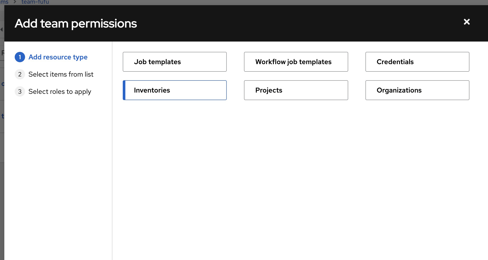
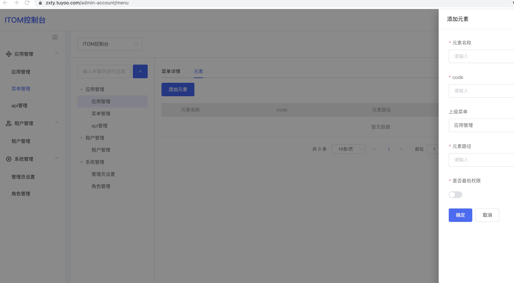

# 当前主要要做的和需要你的帮助的问题

### 当前的目标
使用用户系统的授权功能，参考AWX的设计，结合我们的实际需求，完成作业系统授权模块的开发。

### 步骤：
1. 团队目前在做作业中心的权限和授权，首先要从自身需求出发然后参考AWX的设计。
我看了之后发现AWX的授权有着自己的设计和体系，和RBAC类似但又不全是。
比如AWX有Organazation和Team，还有Role。设定权限的时候，可以分资源的类型。

2. 在另一侧，需要用用户系统的授权功能和api，来完成作业中心的授权功能。
但尽量不破坏和修改已有用户系统的设计和功能，除非用户系统无法完成所需的需求。
这就需要对两边都有比较清晰的了解，才可以做好这件事。

### 遇到的问题
目前我和董璐昨天回忆了下用户系统的需求和已有的软件功能，发现掌握的还不够。
很多功能和名称，比如元素，这根本不知道是什么意思，如何使用。
问了建波他也不知道。

虽然你之前对着软件讲过一遍用户系统，但事实上用户系统没那么简单。
埋头折腾几个月，然后1个小时期望听众可以听清楚，这个是不可能的。
同时你也知道我们包括产品去年一起做了好几个领域的软件，包括cmdb，证书，作业系统，大部分用户系统的内容都忘得差不多了。

举个例子，比方说菜单的创建和元素的创建。
元素的概念是什么？
这些也许背后和RBAC殊途同归，比如Django用User，Group，Permission三个来构建整个权限控制体系的基石。
但这些名词本身的概念和含义需要描述清晰，这样才好具体应用。

### 解决方式的探讨
这些，要想让相关人比如PO团队和研发团队认知到位，这些需要反复讲。如果你能一次讲清楚让人理解是最好。
若做不到，那只能说明还需要继续讲，按照系列来讲，就像我现在给公司做的那个Gitlab课程一样。
如果实在没这个精力和时间，那么还有一个办法。
就是形成文档或者课程，让受众通过学习这些文档和教程，逐步靠自学来掌握这个系统的各个概念，和应用方案。

# 关于用户系统
用户系统是一个公司和你投入了很大心血创作的一款优秀的产品，虽然只是你独立完成，但完成度可以。
在授权和SSO这块基本可以满足我们目前的所有需求。
这个对公司和部门来说是一个宝贵的资产，值得我们珍惜。
我们是想以此产品为起点，展开真正的商业化，然后围绕着用户系统提供周边的产品比如证书管理或者cmdb的一些功能还有作业系统。
要达成这个目标，仅凭你一人是不够的。
不论你是否能做到，或者是否愿意做，**产研团队需要提升对用户系统从产品到开发两方面的认知是客观事实，我们需要。**

# 关于你个人
## 不要给自己设限
张小龙是一个优秀的研发人员，foxmail是他第一个作品。
独立设计，开发，最后也得到了很多经济上的回报。
微信不是张小龙独立开发的，但他是微信的产品经理。
当然，在foxmail那个年代，是个人软件的时代。
并没有现在这么细分产品经理和研发等等的职业分工。

但我们的用户系统是独立设计开发并完成的，虽然说借鉴了很多authing的功能和设计，但这款产品的创作者和极力促进人是你。
这个不是我自己的感觉。而是老邹在我刚来公司的时候和我反映的。
他当时觉得用户系统处于一种失控状态，是否要让你停掉。
这主要还是这个产品除了你之外其他的利益相干人对这个了解不足。
对自己主创的作品，而且是你第一款golang写的作品，这个作品的产品方方面面，你应该给出除了代码之外的更多内容。

目标主要是两个：
1. **让产品团队可以充分了解当前产品的功能和后续的规划（如果有）**
2. **让研发团队可以充分了解产品的架构和模型（库表）包括使用工具比如（Kratos）**

要达成这个目标，不能全靠你，但你必须想办法来逐步引导。
否则这款产品无法让整个团队发力一同推进，而只能靠你一个人。
这个很难我知道，但通过我们一起的努力，我相信一定有办法做到。

## 关于authing文档
**我的观点是：authing的文档很优秀，但我们用户系统本身需要自己的文档。**
哪怕很多功能都是从authing借鉴甚至直接照搬过来的。
但毕竟我们不是authing，功能也只是authing的子集。
同样的道理，authing为什么要去写这些内容？
是否也可以同样把更早一些的auth0的文档给他的客户和产研团队，而无需自己提供自己的文档呢？
你毕竟是用户系统真正意义上的产品经理，或者说原创者，我希望你能够给出除了源代码和可以运作的产品之外，提供出产品手册。
可以参考authing的，甚至可以直接copy过来。
我们产品都是直接借鉴的，文档为什么不行？

